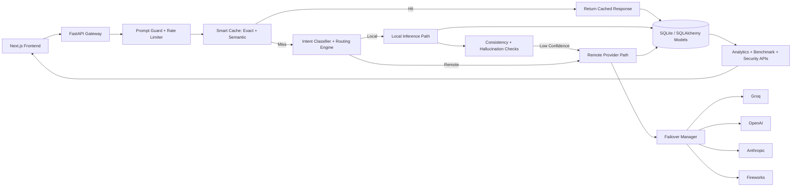

# TriForge: Tech Stack, 3-Person Team Roles, and Architecture View

## 1) Technologies and Tools Used

### Frontend
- Next.js 16
- React 19
- TypeScript 5
- Tailwind CSS 4
- Framer Motion
- Recharts
- Lucide React
- tsParticles (@tsparticles/react, @tsparticles/slim)

### Backend
- Python 3.11
- FastAPI
- Uvicorn
- SQLAlchemy
- Pydantic + pydantic-settings
- python-dotenv
- requests

### Data Layer
- SQLite (default in current setup)
- PostgreSQL driver available (psycopg2-binary)

### AI/LLM Providers and Routing Integrations
- Groq
- OpenAI
- Anthropic
- Fireworks AI
- Local/Ollama fallback hooks

### DevOps and Deployment
- Docker
- Docker Compose
- Render (backend deployment config)
- Vercel (frontend deployment config)

### Testing and Validation
- Pytest backend test suite
- Benchmark runner for local-vs-remote-vs-hybrid comparisons

---

## 2) Recommended Roles for 3 People

### Person 1: Backend + AI Routing Engineer
Own these areas:
- API design and FastAPI endpoints
- Routing engine and intent classifier
- Consistency checks and hallucination guard flow
- Semantic cache and adaptive threshold tuning
- Provider integration and failover behavior

Primary goal:
- Keep response quality high while reducing token cost and latency.

### Person 2: Frontend + Product UX Engineer
Own these areas:
- Chat interface and streaming UX
- Analytics dashboards and benchmark screens
- Settings and model controls UI
- Route explainability badges and metadata display
- Frontend performance and responsive behavior

Primary goal:
- Deliver clear, fast, explainable user experience.

### Person 3: DevOps + QA + Observability Engineer
Own these areas:
- Docker, Compose, environment setup, release hygiene
- Deployments on Render/Vercel
- Secret and environment variable management
- Test automation and regression checks
- Monitoring: security events, failover logs, cache performance, threshold adjustments

Primary goal:
- Ensure reliability, repeatable deployments, and production visibility.

---

## 3) Architecture Explanation (How It Works)

1. User sends a prompt from the Next.js frontend.
2. FastAPI gateway receives request.
3. Security checks happen first:
   - Prompt guard inspection
   - Rate limiting
4. Cache lookup runs in two stages:
   - Exact hash match
   - Semantic similarity match
5. If cache miss, the routing engine classifies intent and complexity.
6. Route choice:
   - Local path for lower-risk/simple prompts
   - Remote path for code-heavy or long/complex prompts
7. If local path is used for risky categories:
   - Consistency/hallucination checks run
   - Low confidence triggers escalation to remote
8. Remote execution uses provider failover chain.
9. Response streams back to frontend (SSE).
10. Logs and metrics are stored for analytics:
   - latency, tokens, cost, cache events, failovers, security events

---

## 4) Architecture Diagram

---

## 5) Ownership Matrix (Quick View)

| Area | Person 1 | Person 2 | Person 3 |
|---|---|---|---|
| FastAPI/API contracts | Primary | Support | Review |
| Routing/classifier/cache/failover | Primary | View integration | Test/observe |
| Next.js UI/UX/streaming | Support | Primary | Review |
| Deployments and infra | Support | Support | Primary |
| Testing and release validation | Support | Support | Primary |
| Analytics and observability quality | Primary (logic) | Primary (visualization) | Primary (operations) |

---

## 6) Suggested Working Rhythm

- Daily: 15-minute sync across all three owners.
- Twice weekly: integration review (API + UI + deployment).
- Weekly: benchmark and reliability review using analytics endpoints.

This file is ready to share or download as a team architecture handoff.
