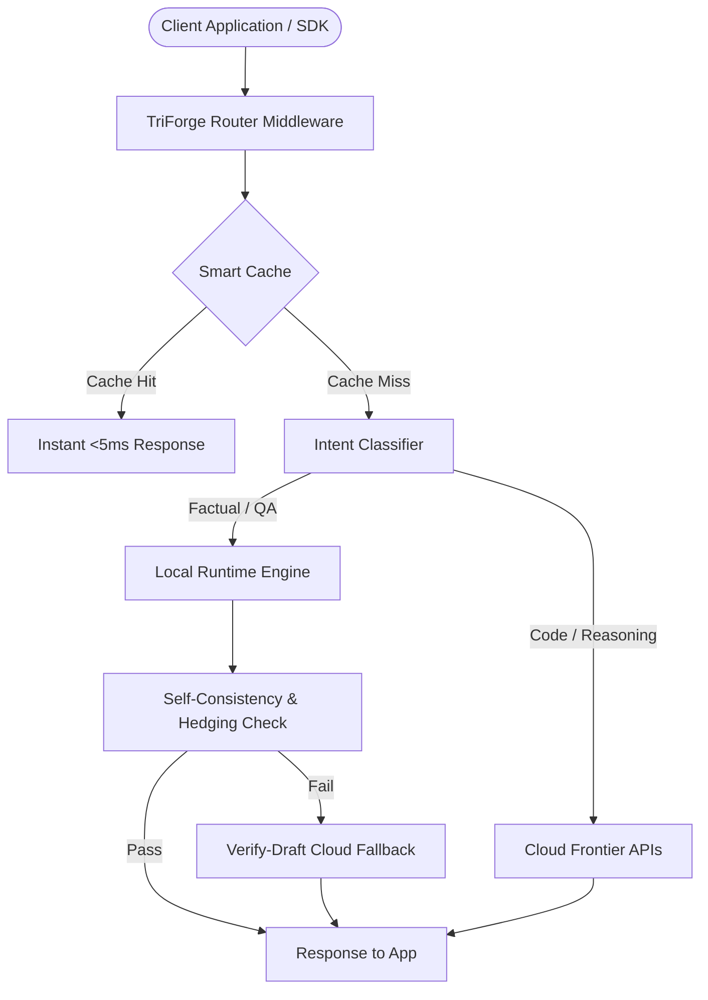

# TriForge — High-Performance LLM Routing & Caching Middleware

> **Theme Focus: Developer Tools & Infrastructure**  
> *Drop-in, low-latency LLM routing engine that slashes API spend by 70%+ while preserving 100% answer quality.*

---

## ⚡ Executive Summary

TriForge is an infrastructure-grade API proxy and routing middleware for engineering teams. It sits between application code and LLM providers, dynamically routing requests between zero-cost local models and frontier cloud APIs based on real-time semantic intent and confidence scoring.

### DevTools Highlights
- **Zero API Lock-in:** OpenAI-compatible API interface; switch underlying backends seamlessly.
- **Smart Caching Layer:** In-memory and SQLite prompt caching eliminates duplicate API queries.
- **Sub-50ms Routing Overhead:** Lightweight Python/FastAPI async architecture handles routing decisions in milliseconds.

---

## 🏛️ System Architecture



---

## 🚀 Key Features

1. **Intelligent Semantic Classifier:** Automatically routes coding, math, reasoning, translation, and conversational queries to optimal model tiers.
2. **Verify-Draft Escalation Protocol:** Uses local drafts as prompt context for remote models, reducing completion token lengths by up to 60%.
3. **Pluggable Multi-Provider Support:** Built-in integrations for Groq, Fireworks AI, OpenAI, Anthropic, and local Ollama.
4. **Developer Telemetry Dashboard:** Complete inspection UI displaying latency distribution, prompt tokens, completion tokens, and route explanations.

---

## ⚙️ Quick Start & Setup

### Prerequisites
- Python 3.11+
- Node.js 20+
- Free Groq API Key (or local Ollama instance)

### 1. Clone & Configure
```bash
git clone https://github.com/Sarthak752008/TriForge.git
cd TriForge
cp .env.example .env
# Add your GROQ_API_KEY to .env
```

### 2. Launch Backend (FastAPI)
```bash
cd backend
pip install -r requirements.txt
python -m uvicorn app.main:app --host 0.0.0.0 --port 8000 --reload
```

### 3. Launch Frontend (Next.js)
```bash
cd frontend
npm install
npm run dev
```
Open `http://localhost:3000` to inspect live developer telemetry and benchmarks.

---

## 📑 Multi-Hackathon Positioning Framework
- **[DevTools & Infra Focus (Current)](./README-devtools.md)** — Drop-in cost optimizer for dev teams.
- **[Sustainability Focus](./README-sustainability.md)** — Green AI & energy tracking.
- **[FinTech & Governance Focus](./README-fintech.md)** — AI spend governance for finance.
- **[Open-Source AI Focus](./README-opensource.md)** — Pluggable BYOM architecture.
