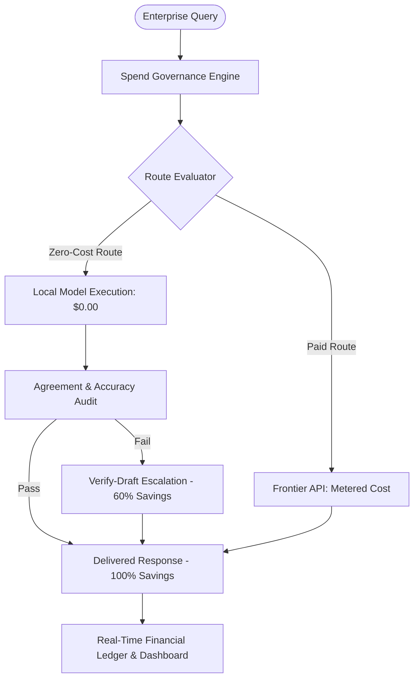

# TriForge — AI Spend Governance & Cost Optimization Platform

> **Theme Focus: FinTech & Enterprise AI Cost Governance**  
> *Real-time financial telemetry, budget enforcement, and token spend reduction for enterprise AI operations.*

---

## 💰 Executive Summary

TriForge is an enterprise financial governance platform for AI spend management. As organizations scale generative AI deployments, API token costs compound rapidly. TriForge provides real-time financial tracking, automated token-saving routing, and transparent ROI metrics to keep AI budgets predictable and audit-ready.

### Financial Highlights
- **70%+ Cost Reduction:** Offloads lightweight and repetitive workloads from premium cloud APIs to zero-cost local hardware.
- **Real-Time Cost Audit Trail:** Logs exact USD expenditure per request down to $0.000001 precision.
- **Configurable Risk Thresholds:** Financial managers can adjust agreement thresholds to balance model quality against token expenditure.

---

## 🏛️ Financial Routing Model



---

## 🚀 Key Features

1. **Automated Cost-Saving Routing:** Prevents wasting expensive cloud API calls ($0.20-$15.00/1M tokens) on simple factual prompts.
2. **Verify-Draft Cost Reduction:** When cloud models are needed, passes pre-generated local drafts to minimize expensive output token generation.
3. **Financial Analytics Dashboard:** Displays daily cost vs savings time-series charts, cache hit rate economics, and cumulative savings.
4. **Exportable Evaluation Reports:** Generate 1-click Markdown/CSV benchmark evaluation reports for executive budget reviews.

---

## ⚙️ Quick Start & Setup

### Prerequisites
- Python 3.11+
- Node.js 20+
- Free Groq API Key (or local Ollama instance)

### 1. Clone & Configure
```bash
git clone https://github.com/Sarthak752008/TriForge.git
cd TriForge
cp .env.example .env
# Add your GROQ_API_KEY to .env
```

### 2. Launch Backend (FastAPI)
```bash
cd backend
pip install -r requirements.txt
python -m uvicorn app.main:app --host 0.0.0.0 --port 8000 --reload
```

### 3. Launch Frontend (Next.js)
```bash
cd frontend
npm install
npm run dev
```
Open `http://localhost:3000` to access the AI Spend Governance Dashboard.

---

## 📑 Multi-Hackathon Positioning Framework
- **[FinTech & Governance Focus (Current)](./README-fintech.md)** — AI spend governance for finance.
- **[Sustainability Focus](./README-sustainability.md)** — Green AI & energy tracking.
- **[DevTools & Infra Focus](./README-devtools.md)** — Drop-in cost optimizer for dev teams.
- **[Open-Source AI Focus](./README-opensource.md)** — Pluggable BYOM architecture.
