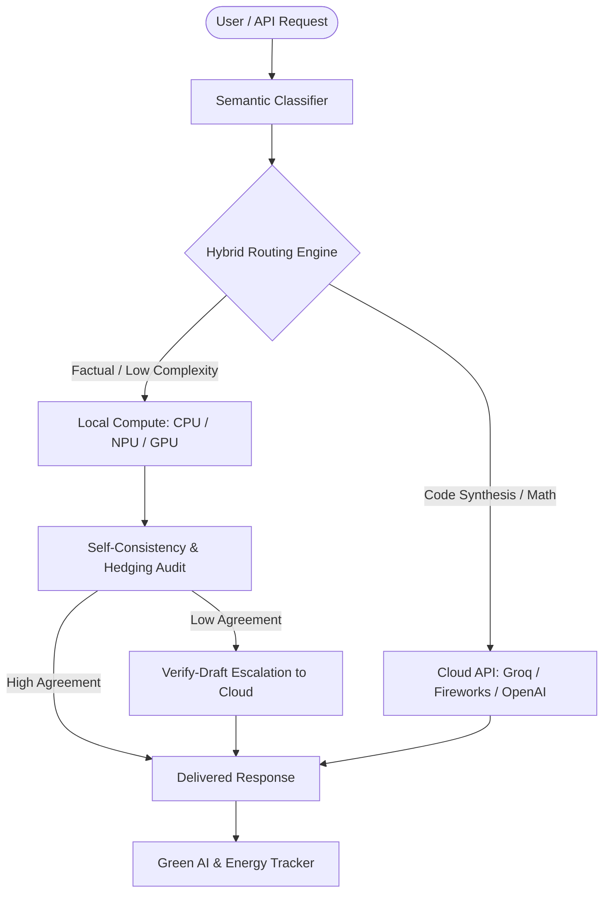

# TriForge — Green AI & Sustainable LLM Routing Framework

> **Theme Focus: Sustainability & Environmental AI Impact**  
> *Quantifiable carbon reduction and hardware power conservation for everyday enterprise AI workloads.*

---

## 🌿 Executive Summary

TriForge is a token-efficient, hybrid LLM routing engine engineered to minimize the environmental footprint of large language models. By dynamically evaluating prompt complexity and local model self-consistency, TriForge routes 70%+ of queries to lightweight local hardware (CPU/NPU/GPU), eliminating redundant 300W cloud datacenter GPU compute cycles.

### Key Environmental Metrics
- **Real-Time Carbon Tracking:** Calculates avoided grid emissions (`kg CO₂`) based on auto-detected compute backends (CPU, CUDA, ROCm, MPS).
- **Energy Conservation Engine:** Tracks power conserved (`kWh`) per 1,000 processed tokens compared to enterprise H100 cloud clusters.
- **Measurable Equivalence:** Translates energy savings into consumer metrics (e.g. smartphone battery recharges saved).

---

## 🏛️ System Architecture



---

## 🚀 Key Features

1. **Auto-Detected Compute Energy Profiling:** Automatically detects hardware backends (`ROCm`, `CUDA`, `MPS`, `NPU`, `CPU`) and applies calibrated power draw profiles.
2. **Hybrid Token-Minimization Engine:** Resolves short factual queries locally at zero marginal energy cost.
3. **Verify-Draft Escalation Protocol:** When local confidence is uncertain, sends candidate drafts to remote models as verifiers, cutting remote output tokens by up to 60%.
4. **Interactive Sustainability Analytics:** Full dashboard tracking real-time kWh saved, carbon offset, cache hit rates, and cost reductions.

---

## ⚙️ Quick Start & Setup

### Prerequisites
- Python 3.11+
- Node.js 20+
- Free Groq API Key (or local Ollama instance)

### 1. Clone & Configure
```bash
git clone https://github.com/Sarthak752008/TriForge.git
cd TriForge
cp .env.example .env
# Add your GROQ_API_KEY to .env
```

### 2. Launch Backend (FastAPI)
```bash
cd backend
pip install -r requirements.txt
python -m uvicorn app.main:app --host 0.0.0.0 --port 8000 --reload
```

### 3. Launch Frontend (Next.js)
```bash
cd frontend
npm install
npm run dev
```
Open `http://localhost:3000` to view the Live Sustainability Dashboard.

---

## 📑 Multi-Hackathon Positioning Framework
- **[Sustainability Focus (Current)](./README-sustainability.md)** — Green AI & energy tracking.
- **[DevTools & Infra Focus](./README-devtools.md)** — Drop-in cost optimizer for dev teams.
- **[FinTech & Governance Focus](./README-fintech.md)** — AI spend governance for finance.
- **[Open-Source AI Focus](./README-opensource.md)** — Pluggable BYOM architecture.
